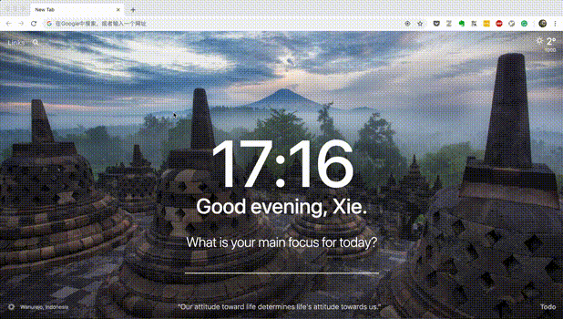

# Upload image to Ali OSS in Alfred. （使用Alfred上传图片到阿里OSS）

  

The **oss_uploader** is an [Alfred](https://www.alfredapp.com) Workflow plugin for uploading images to Ali OSS.



[Demo in Youtube](https://youtu.be/FFC_sS3WoGo)

## 1. Download

You can download the latest version in [Github releases page](https://github.com/xiaoyuxie-vico/oss_uploader).

## 2. Usage

### 2.1 Set the basic config in `setting.py`
You should set your own information in these codes:
```
# Define Global Variables
UPDATE_SETTINGS = {'github_slug': 'xiaoyuxie-vico/oss_uploader'}      # example
HELP_URL = 'https://github.com/xiaoyuxie-vico/oss_uploader/issues'    # example

# oss info
OSS_INFO = {
    'access_key_id': 'your_access_key_id',
    'access_key_secret': 'your_access_key_secret',
    'bucket_name': 'your_bucket_name',
    'endpoint': 'http://oss-cn-XXX.aliyuncs.com',
}

```

### 2.2 General Search

Try keyword `oss image_name` to upload.

## 3. Functions (updating)
- Upload clipboard image data to Ali OSS (v1.0.1);
- Rename the image name before upload (v1.0.1);
- Reduce the image size before upload (Using [TinyJPG](https://tinyjpg.com)) (v1.0.2);
- [TODO] Upload the local image (single or in batch);

## Acknowledgement

This Alfred Workflow plugin is developed based on [deanishe/alfred-workflow](https://github.com/deanishe/alfred-workflow) and [TooSchoolForCool/LeetCode-Search](https://github.com/TooSchoolForCool/LeetCode-Search). Thanks for this great helper library.
